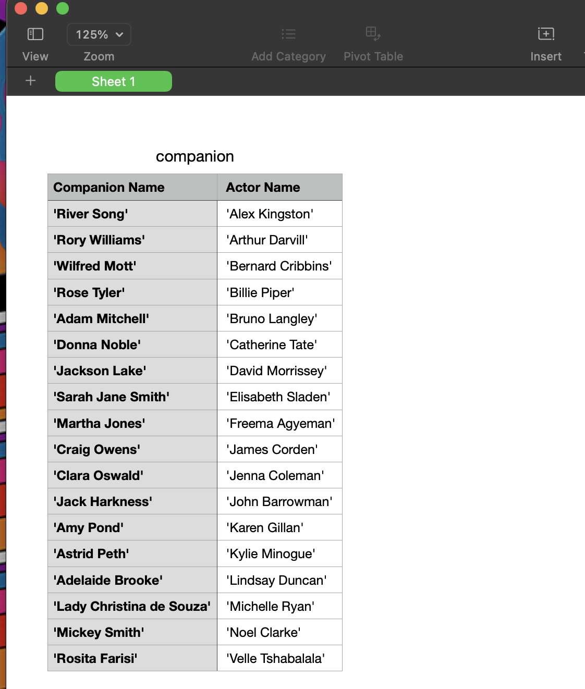
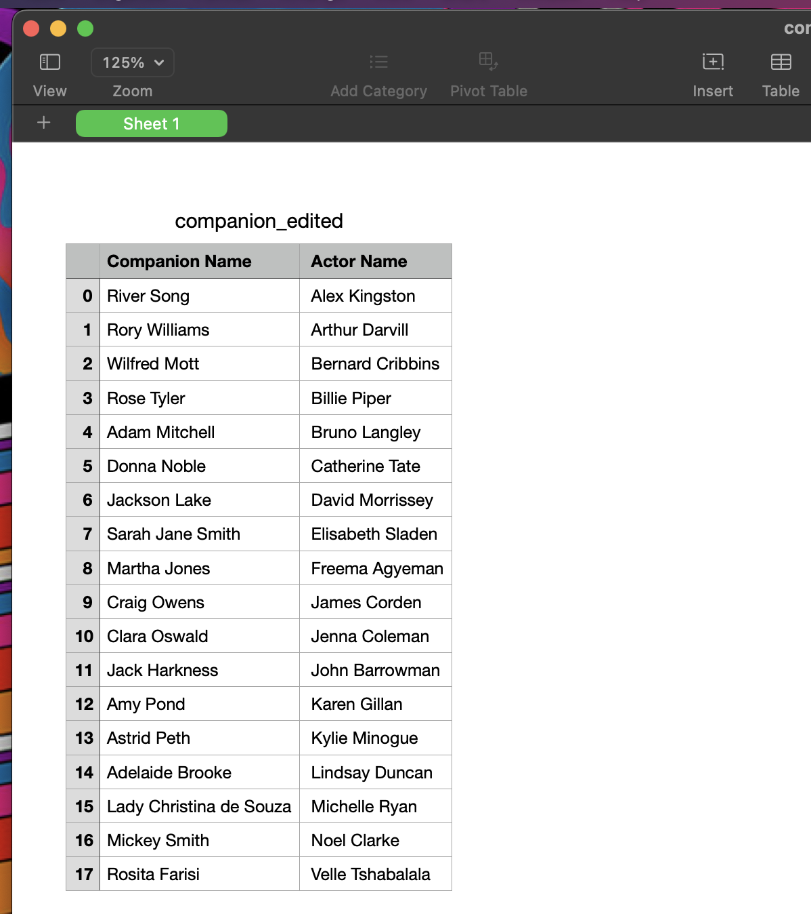

## Remove Quotes Script

This script was created for the purpose of fixing one of the issues in the OMD_data_engineering_test for the position of Senior Manager Data Assessment.

It addresses question 4 in Part A of the assessment on how to fix the `companion.csv` data by removing the quotes from the data.

Below is the image of the data before running the script.

This is the image after runnung the script.

#### Commands

Clone the project

> git clone git@github.com:wanjiku-carol/gcp_data_processor.git

Change directory to the companion directory

> cd companion

Run the script

> python run.py
